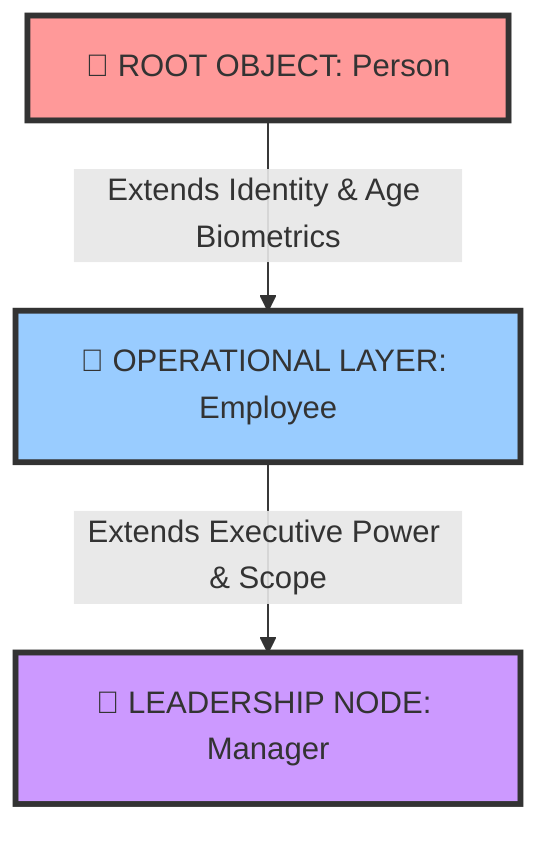

# PR-5_OOP_wrapper
# 🗺️ THE CORPORATE METROPOLIS (v1.0.0)
### 🌐 An Ultra-Scalable Python OOP Ecosystem for Organizational Hierarchy Simulation

<p align="center">
  
  
  
  
</p>

---

## 📖 Executive Summary & Core Vision

Har ek complex enterprise system ke piche ek majboot architectural backbone hoti hai. **The Corporate Metropolis** sirf ek simple console script nahi hai—yeh ek simulated organizational reality engine hai. 

Is ecosystem ka main maqsad real-world business hierarchies ko pure programmatic objects me convert karna hai. Yeh model ek basic biological citizen (**Person**), ek active working infrastructure professional (**Employee**), aur ek high-level department planner (**Manager**) ke beech ke linear lifestyle link ko automate karta hai.

Bina kisi heavy, external database system ke overhead ke, yeh engine Python ke volatile RAM allocation systems ka use karke instant micro-second runtime efficiency delivery ko maintain karta hai.

---

## 📐 The Master Architectural Blueprint

Niche di gayi blueprint matrix me aap is pure system ke structural chain-of-command aur directional data flow dependency ko visual dekh sakte hain:



---

## ⚡ Technical Breakdown: The 4 Pillars of OOP

Humne aapke custom written software engineering design principles ko is environment me step-by-step implement kiya hai:

### 🧬 1. Multi-Level Deep Inheritance (Vansh-Anukram Protocol)
Don't Repeat Yourself (DRY) principle ka strict application!
* **The Ancestor (`Person`)**: Base model jo universal biological structures (Name aur Age constraints) ko generate aur lock karta hai.
* **The Successor (`Employee`)**: Yeh base template ko reuse karta hai aur context ko badhakar usme explicit company identifiers aur global financial values connect karta hai.
* **The Elite (`Manager`)**: Hierarchy ka peak point, jo upar ke dono levels ke records ko instantly inherit karta hai aur runtime space me targeted department monitoring controls set karta hai.

### 🔒 2. Total Data Encapsulation (Suraksha Kavach Shield)
Corporate data leaks ko code level par prevent karne ke liye:
* **Private Key Tokenization**: Critical identifiers jaise Employee Unique ID (`__employee_id`) aur Payroll Ledger (`__salary`) ko memory variables me double-underscore prefix ke sath heavily lock kiya gaya hai.
* **Isolated Access Gateways**: In absolute parameters ko class boundary ke bahar se koi bhi third-party procedure check ya manual assignments corrupt nahi kar sakte. Attributes me changes sirf valid custom setter pipelines ke structural loops ke through hi pass hote hain.

### 🎭 3. Runtime Polymorphism (Bahuroopiya Engine Logic)
Dynamic message formatting ka super implementation:
* **Context-Aware Routines**: `display()` aur `details()` interfaces universal command parameters hain, lekin inka core workflow target profile ke type (Person, Employee, ya Manager) ke hisab se runtime par khud ko dynamically morph aur rearrange kar leta hai.
* **Smart Structure Identification**: Core application loops ko explicit parsing checks chalane ki jarurat nahi padti; instances apni position khud trace karke exact structural detail matrices render karte hain.

### ♻️ 4. Abstraction & Automatic Lifecycle Management (Auto-Cleanup)
* **Under-the-Hood Construction**: Upstream variables aur mathematical definitions automatically link hote hain internal base components ke sath via `super().__init__()` mapping hooks.
* **Active Destructor System**: Garbage Collection ko optimize karne ke liye, jaise hi system terminal close hone ki stage par aata hai ya arrays clear hote hain, ek explicit destructor tool `__del__` execute hota hai, jo active session resources ko terminal confirmation ke sath drop karta hai.

---

## 🕹️ Control Room Dashboard (The Master Menu)

Aapka working console layout ek industrial management panel ki tarah organize kiya gaya hai. Niche di gayi comparison sheet iske background logic flow ko break down karti hai:

| Interactive Command | Feature Panel | Behind-The-Scenes Internal Engine Pipeline |
| :---: | :--- | :--- |
| **Option 1️⃣** | **Create Person** | Instantly spawns a clean citizen node and appends the instance to the volatile `Persons` registry track. |
| **Option 2️⃣** | **Create Employee** | Runs identity validation logic, verifies non-existence of IDs, maps salary levels, and boots an operational workspace. |
| **Option 3️⃣** | **Create Manager** | Escalates profiles into the Executive tier, anchors an administrative department, and catalogs the entry inside management matrix arrays. |
| **Option 4️⃣** | **Show Details** | Opens a multi-tier nested database reporting terminal to filter and preview data summary logs with dedicated entity headers. |
| **Option 5️⃣** | **Check Subclass** | Executes deep architecture inspection rules to programmatically check parent-child entity trees using live `issubclass` tokens. |
| **Option 6️⃣** | **Emergency Shutdown**| Fires memory extraction sequence, activates structural destructors, flushes tracking arrays, and cleanly drops terminal operations. |

---

## 🛡️ Built-in Integrity Gates & Safety Valves

Application crashes ko prevent karne aur database hygiene maintain karne ke liye systems background me strict guards maintain karte hain:

* 🚫 **Anti-ID Clone Shield**: Naye professional registry setup ke dauran internal scanners poori `Employees` list ko linear parse karte hain. Agar user-requested ID pehle se generated kisi profile se clash hoti hai, toh insertion block ho jata hai aur message show hota hai: *"This ID already exists!"*
* 📉 **Negative Financial Filter**: System updates ke dynamic pathways par validations continuously scan karte hain input streams ko. Agar check-amount drops zero ya minus boundary cross kare, toh setter system change request ko drop kar deta hai aur dashboard error raise karta hai.
* 🛑 **Empty State Null-pointer Avoidance**: Agar computational lists me ek bhi data profile register nahi hai aur user state fetch karne ki koshish kare, toh application standard runtime failures ya index breaks face karne ki jagah dynamic informational safeguards fire karti hai: *"Not exist right now!"*

---

## 🔄 System Execution & Data Lifecycle States

1. **System Boot State**: Volatile RAM space initialize hota hai. Custom references map hote hain aur dynamic storage containers (`Persons=[]`, `Employees=[]`, `Managers=[]`) allocate kiye jaate hain.
2. **Interactive Awaiting Loop**: User input listener continuously poll karta hai choices ko aur capture parameters evaluate hone ke liye wait karte hain.
3. **Data Verification Pipeline**: Entry checks complete hotey hi properties encapsulate ho jati hain classes ke protected memory arrays me.
4. **Polymorphic Evaluation**: Context mapping arrays block design rules apply karke console window par beautifully structured details layout construct karte hain.
5. **Session Destruction Stage**: Variable bindings safely drop hoti hain, internal cleanup systems alert echo karte hain aur process terminate ho jata hai.

---

## 📂 Eco-System Space Mapping

Project directories ko minimal, ultra-modern aur scalable templates par plan kiya gaya hai taaki long-term modular migrations easy ho sakein:

```text
🏢 Corporate-Metropolis-Ecosystem/
│
├── 📜 main.py          # Central Control Unit & Architecture Definition Engine
└── 📜 README.md        # The Deep-Dive Operational Document & Visual Blueprint (This File)
```

---

## 🗺️ Visionary Future Roadmap & Scalability Matrix

- [ ] **Data Layer Modernization**: Temporary volatile variable memory buffers ko standard relational database system engines (jaise SQLite ya persistent JSON document mapping frameworks) se scale-up karna.
- [ ] **Bulletproof Data Type Assertions**: Character validation filters inject karna taaki agar operational terminal menu input par koi dynamic character typos pass ho sakein, toh unpar core code break hone ke bajaye automated graceful error recoveries fire ho sakein.
- [ ] **Sleek Graphics UI Upgrade**: Bare text console layout systems ko upgrade karke ek production-level, modern visual desktop management interface application window framework (`Tkinter`, `PyQt`, ya neon `CustomTkinter` templates) par shifts karna.
- [ ] **Cross-Enterprise Inter-Relational Node Trees**: Management layers me changes implementation taaki single Manager object real-world scenarios ki tarah unique employee arrays ko list form me completely control aur trace kar sake.

---

